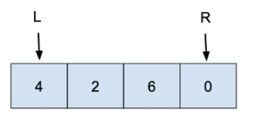

# Two Pointers
**Need to make two pointers**

1. make a left pointer and right pointer:
   `l,r = 0, len(list) - 1`
2. move left pointer to right or move right pointer to left by one in different condition:
   `if ...: l += 1` and
   `if ...: r -= 1`
3. program ends with left pointer next to the right pointer

# Stack
